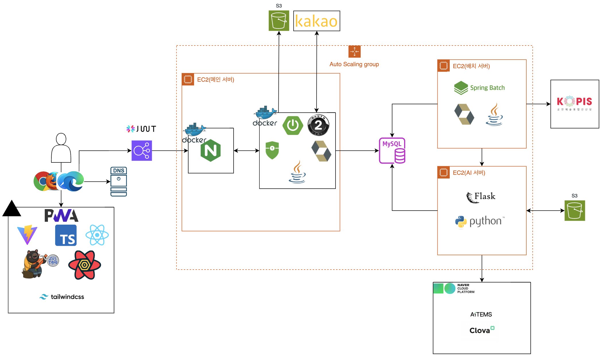
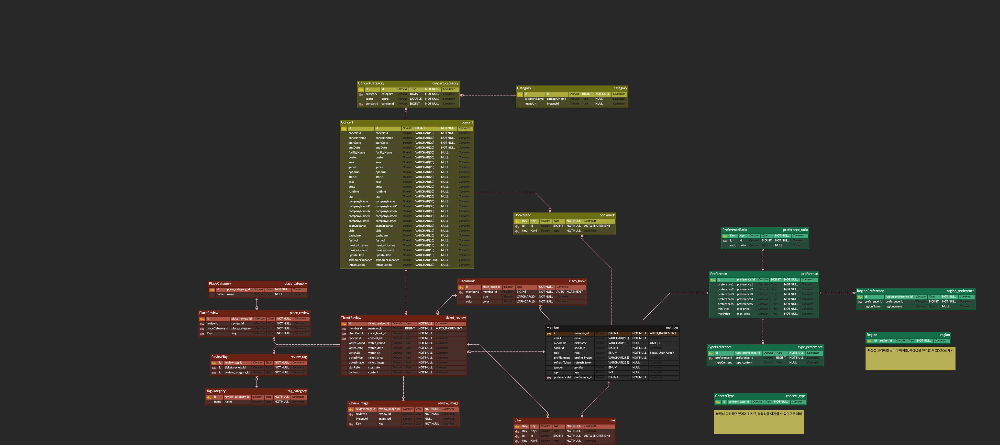
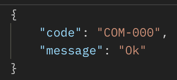
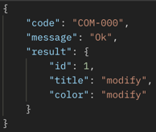

## Curate Me 개발팀

### 팀원

| 이름  | 파트        | 담당 업무                                                      |
|-----|-----------|------------------------------------------------------------|
| 김진희 | FE        | 소셜 로그인, 온보딩, 공연 상세, 둘러보기,   티켓 등록 서비스 GUI 개발 및 API 연동   |
| 성태현 | FE        | 서비스 메인, 리뷰, 클라코북 만들기,   마이페이지 서비스 GUI 개발 및 API 연동       |
| 이건  | BE <개발리드> | 아키텍처 설계, ERD 설계, 인증/인가 기능,   회원가입 기능, 티켓&리뷰 기능          |
| 정희찬 | BE        | 배치 서버 설계 및 구현, AI 서버 설계 및 구현,   추천 시스템 구현(AI), 공연 정보 기능 |

## Architecture

## ERD

## API 응답 형식

 

